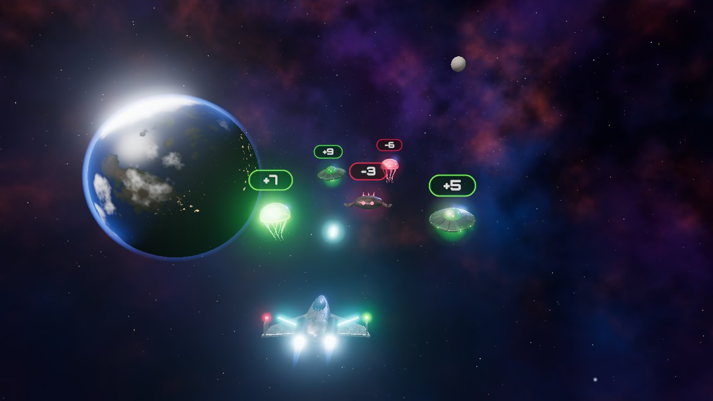
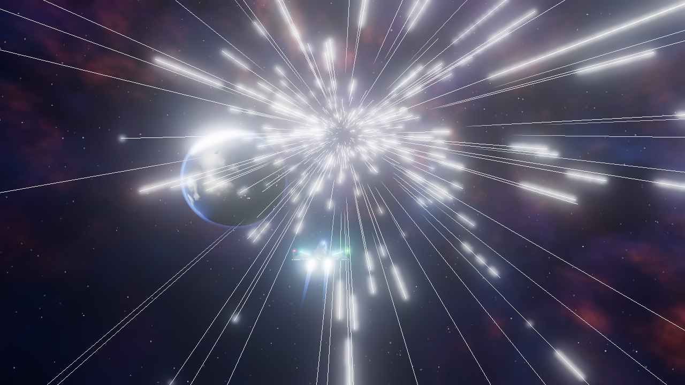
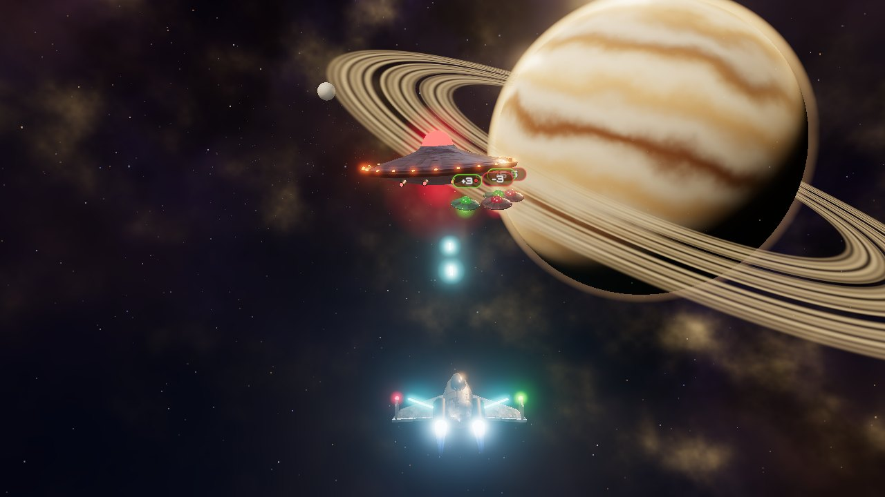

# 🚀 Math Invaders

**A 3D space shooter where kids practice math without noticing they're doing it.**

Every alien carries a number. Your mission is to blast the right ones so your total lands *exactly* on the goal. Kids are busy dodging, aiming and warping through hyperspace, and all the while they're doing quick mental addition and subtraction, including negative numbers.



---

## Why kids like it

- **It feels like a real game.** It has a detailed 3D starfighter, glowing aliens, explosions and big boss battles, not worksheets with a spaceship sticker on them.
- **Every mission takes you somewhere new.** After each win the ship jumps through hyperspace into a new sector of the galaxy: a lava world, a ringed ice planet, a giant striped gas planet, and more.
- **Mistakes don't end the game.** Run out of shields and you get one more chance: solve a quick equation to reboot the ship and keep flying.
- **Short, satisfying rounds.** Each mission is a small, clear goal, so it's easy to play "just one more".



## What kids practice

| Skill | How the game builds it |
|---|---|
| **Mental addition and subtraction** | Every hit changes the running total. Kids work out what the total will become before they fire. |
| **Negative numbers** | Red aliens are negative (−3, −6…). Hitting one makes the total go *down*, so "adding a negative" becomes something kids can feel. |
| **Planning and number sense** | Goal is 22 and the total is 15? You need +7, or +9 and then −2. Kids start planning a few moves ahead. |
| **Fixing mistakes** | Went over the goal? Find a red alien to bring the total back down. |
| **Fact fluency under light pressure** | The System Failure reboot gives a quick + or − problem that gets harder at higher levels. |

Difficulty grows slowly as you play. Goals start around 15–25 and climb with each mission. Alien numbers get bigger and aliens move faster, so the game stays about as hard as the player can handle.

## How to play

1. Look at your **Goal** (top left).
2. Shoot aliens to change your **Total**: 🟢 **green = add**, 🔴 **red = subtract**.
3. Make your Total **exactly equal** the Goal to complete the mission.
4. Don't let aliens crash into your ship. You have **3 shields**.
5. Every **3rd mission** a **Mothership** attacks. Each hit on it releases both green and red aliens, and you have to reach a bigger goal (50–99) before its health bar runs out.

### Controls

| Device | Move | Fire |
|---|---|---|
| **Phone / tablet** | Touch and drag | Tap |
| **Keyboard** | ← → or A / D | Space |
| **Mouse** | Click where you want to go | Click |



## For parents and teachers

- **No accounts, no ads, no tracking.** The game doesn't collect or send any data.
- **Works offline** once it's loaded. It installs as an app (PWA), and fonts, sounds and graphics are all built in.
- **Runs almost anywhere:** a web browser on a phone, tablet, Chromebook or PC, plus Android and iOS builds.
- **Best age range:** roughly 6–11, for kids comfortable with numbers up to 20 who are ready to stretch further.

---

## Under the hood

| | |
|---|---|
| **3D graphics** | [Three.js](https://threejs.org/): realistic metal materials, glow effects, a procedurally drawn nebula sky, planets and particle explosions. No image files are needed. |
| **Sound** | Every sound effect is synthesized live with the Web Audio API. There are no audio files. |
| **App** | React 19 + Vite, installable PWA |
| **Mobile** | Capacitor builds for Android and iOS |
| **Hosting** | Firebase Hosting |

### Project layout

```
src/
  components/
    GameCanvas.jsx      # HUD, menus and overlays (React)
    ReviveMiniGame.jsx  # "System Failure" math reboot
  game/
    engine.js           # Game rules, controls, camera, render loop
    models.js           # Ship, aliens and Mothership built from 3D shapes
    scenery.js          # Nebula sky, planets and the six galaxy sectors
    effects.js          # Explosions, debris and shockwaves
    sound.js            # Synthesized sound design
    textures.js         # Generated hull panels, glows and number badges
```

### Run it locally

```bash
npm install
npm run dev        # start a dev server at http://localhost:5173
npm run build      # production build into dist/
```

### Build the mobile apps

```bash
npm run build
npx cap sync       # copy the web build into the android/ and ios/ projects
npx cap open android
```

### Deploy to the web

```bash
npm run build
firebase deploy --only hosting
```
